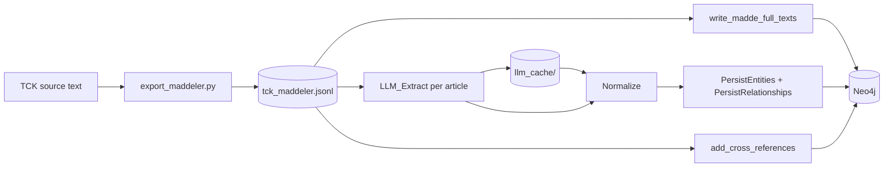

# Algorithm 1: Knowledge Graph Construction from the Turkish Penal Code (TCK)

**Report — Offline indexing pipeline**  
**Project:** TCK GraphRAG  
**Last updated:** May 2026

---

## 1. Purpose and scope

Algorithm 1 transforms the statutory text of the *Türk Ceza Kanunu* (TCK) into a **typed property graph** stored in Neo4j. The graph supports downstream **GraphRAG** retrieval: multi-hop traversal over offences, sanctions, conditions, and cross-references between articles.

This document describes the algorithm at the level of a methods appendix: inputs, outputs, control flow, invariants, and implementation mapping. Online query algorithms (GraphRAG / BasicRAG) are out of scope here.

---

## 2. Inputs and outputs

| Symbol | Description |
|--------|-------------|
| **Input** \(D\) | Corpus of TCK articles: \(D = \{d_1, \ldots, d_N\}\), each \(d_i\) with `madde_no`, `baslik`, `icerik` (full article text), and structural metadata (`kitap`, `kisim`, `bolum`). |
| **LLM** | Extraction model (e.g. GPT-4o) with a fixed system prompt enforcing entity/relationship schemas. |
| **Output** \(G\) | Directed labeled graph \(G = (V, E)\) in Neo4j: nodes `(:Entity:<TypeLabel>)`, edges with **native** relationship types (e.g. `[:CEZA_OLARAK]`). |
| **Auxiliary** | Per-article LLM response cache; indexing checkpoint for resumable runs. |

**Scale (evaluation build):** ~1,577 nodes, ~2,366 relationships; **1,572** counted entities when aggregating non-`MADDE` nodes plus distinct article numbers on `MADDE` nodes.

---

## 3. Design invariants

1. **No orphan entities (except `MADDE`):** Every extracted entity must appear in at least one relationship (enforced by the extraction prompt; validated in post-processing where applicable).
2. **Canonical naming:** Turkish-aware normalization maps surface forms to a single node key (`name`), e.g. *Hırsızlık* / *HIRSIZLIK* → one entity.
3. **Article accumulation:** When the same offence or concept appears in multiple articles, `madde_no_list` accumulates all source articles instead of overwriting blindly.
4. **Native edge types:** Relationships are stored as typed Neo4j edges, not as generic edges with a `type` property—this enables efficient pattern queries during traversal.
5. **Full text on article nodes:** Each `MADDE` node carries `full_text` from the corpus (not from the LLM), ensuring faithful statutory context at retrieval time.

---

## 4. Entity and relationship schema

### 4.1 Entity types (whitelist)

| Code | Role |
|------|------|
| `MADDE` | Statutory article reference (`Madde X`) |
| `SUC` | Offence (including qualified variants, e.g. *Nitelikli Hırsızlık*) |
| `CEZA` | Sanction type (*Hapis Cezası*, *Adlî Para Cezası*, …) |
| `SURE` | Duration or rate (*1 yıldan 3 yıla kadar*, aggravation ratios) |
| `KOSUL` | Aggravating / mitigating condition |
| `KAVRAM` | Legal concept (*Kast*, *Taksir*, …) |
| `TANIM` | Statutory definition (*Kamu Görevlisi*, *Çocuk*, …) |
| `KISIM`, `BOLUM` | Structural hierarchy (optional in graph) |

### 4.2 Relationship types (whitelist)

| Type | Semantics |
|------|-----------|
| `TANIMLAR` | Article defines offence / concept / definition |
| `CEZA_OLARAK` | Offence → sanction |
| `SURE_OLARAK` | Sanction → duration |
| `AGIRLAŞTIRIR` / `HAFIFLETIR` | Condition aggravates / mitigates target |
| `NITELIKLISI` | Qualified offence → base offence |
| `REFERANS_VERIR` | Cross-reference between articles |
| `ICERIR` | Part / chapter contains article |
| `ILGILI` | Fallback relatedness |

---

## 5. Algorithm 1 — `BuildKnowledgeGraph(D)`

### 5.1 High-level procedure

```
Algorithm 1: BuildKnowledgeGraph(D)
────────────────────────────────────────────────────────────────
Input:  Article corpus D = {d₁, …, dₙ}
Output: Property graph G = (V, E) in Neo4j

 1:  V ← ∅ ; E ← ∅
 2:  optionally ClearGraph()                    // full rebuild only

 3:  // Phase A — Attach canonical article texts (no LLM)
 4:  for each dᵢ ∈ D do
 5:      vᵢ ← CreateOrUpdateMaddeNode(dᵢ)
 6:      V ← V ∪ {vᵢ}
 7:  end for

 8:  // Phase B — LLM extraction per article
 9:  for each dᵢ ∈ D do
10:      if Cached(dᵢ.madde_no) then
11:          (Eᵢ, Rᵢ) ← LoadCache(dᵢ.madde_no)
12:      else
13:          (Eᵢ, Rᵢ) ← LLM_Extract(dᵢ.icerik)     // structured JSON
14:          SaveCache(dᵢ.madde_no, Eᵢ, Rᵢ)
15:      end if
16:      (Eᵢ', Rᵢ') ← Normalize(Eᵢ, Rᵢ)
17:      V ← V ∪ PersistEntities(Eᵢ', dᵢ.madde_no)   // MERGE by name
18:      E ← E ∪ PersistRelationships(Rᵢ')          // native rel types
19:      UpdateCheckpoint(dᵢ.madde_no)
20:  end for

21:  // Phase C — Deterministic cross-references (no LLM)
22:  for each dᵢ ∈ D do
23:      refs ← ExtractArticleReferences(dᵢ.icerik)   // regex / patterns
24:      for each r ∈ refs do
25:          E ← E ∪ {(Madde dᵢ.madde_no) ─REFERANS_VERIR─> (Madde r)}
26:      end for
27:  end for

28:  return G = (V, E)
────────────────────────────────────────────────────────────────
```

### 5.2 Subroutine: `LLM_Extract(text)`

The language model receives the full text of one article and returns JSON:

```json
{
  "entities": [
    { "name": "...", "type": "SUC|CEZA|...", "description": "...", "madde_no": 141 }
  ],
  "relationships": [
    { "source": "...", "target": "...", "type": "CEZA_OLARAK", "description": "..." }
  ]
}
```

**Prompt constraints (summary):**

- Extract all legally relevant entities and edges for that article slice.
- Link every `KOSUL` to at least one `SUC` via `AGIRLAŞTIRIR` or `HAFIFLETIR`.
- Create explicit `NITELIKLISI` edges between qualified and base offences.
- Normalize offence names to short statutory labels (avoid sentence-long entity names).

```
LLM_Extract(text):
    prompt ← SYSTEM_SCHEMA + text
    raw    ← LLM(prompt)
    data   ← ParseJSON(raw)                    // strip markdown fences if present
    return (data.entities, data.relationships)
```

### 5.3 Subroutine: `Normalize(entities, relationships)`

```
Normalize(E, R):
    E' ← ∅
    for each e ∈ E:
        if e.name is empty: continue
        e'.name ← NormalizeEntityName(e.name)      // Turkish case, trim, "Madde X"
        e'.type ← ValidateType(e.type)             // whitelist or default KAVRAM
        if e'.type = MADDE and e'.madde_no is null:
            e'.madde_no ← ExtractMaddeNo(e'.name)
        E' ← E' ∪ {e'}
    end for

    R' ← ∅
    for each r ∈ R:
        if r.source or r.target is empty: continue
        r'.source ← NormalizeEntityName(r.source)
        r'.target ← NormalizeEntityName(r.target)
        r'.type   ← ValidateRelType(r.type)        // whitelist or ILGILI
        R' ← R' ∪ {r'}
    end for
    return (E', R')
```

**`NormalizeEntityName`:** Unicode normalization, Turkish lower/upper mapping, whitespace collapse, canonical *Madde {n}* formatting for article entities.

### 5.4 Subroutine: `PersistEntities(E', current_madde_no)`

Each entity is merged into Neo4j by unique `name` (global identity):

```
PersistEntities(E', m):
    for each e ∈ E':
        MERGE (node:Entity {name: e.name})
        ON CREATE SET
            node.type = e.type,
            node.description = e.description,
            node.source_text = e.source_text,
            node.madde_no = e.madde_no,
            node.madde_no_list = [m] if m applicable else []
        ON MATCH SET
            // Append m to madde_no_list if not present
            // Prefer longer source_text / description
            // Update madde_no under type-specific rules (MADDE vs SUC)
        SET node:<TypeLabel>                        // e.g. :Suc, :Ceza
    end for
```

**Merge policy intuition:** The first article that introduces *Hırsızlık* sets primary fields; later articles append `m` to `madde_no_list` without fragmenting the graph into duplicate offence nodes.

### 5.5 Subroutine: `PersistRelationships(R')`

```
PersistRelationships(R'):
    for each r ∈ R':
        MATCH (s:Entity {name: r.source})
        MATCH (t:Entity {name: r.target})
        if s or t missing: skip or log warning
        MERGE (s)-[rel:r.type]->(t)
        SET rel.description = r.description,
            rel.source_text = r.source_text
    end for
```

Invalid relationship types fall back to `ILGILI`.

### 5.6 Subroutine: `CreateOrUpdateMaddeNode(d)`

```
CreateOrUpdateMaddeNode(d):
    name ← "Madde " + d.madde_no
    MERGE (m:Entity:Madde {name: name})
    SET m.full_text = d.icerik,
        m.baslik = d.baslik,
        m.kitap = d.kitap,
        m.kisim = d.kisim,
        m.bolum = d.bolum,
        m.madde_no = d.madde_no
    return m
```

Article bodies come **directly from the corpus**, decoupling statutory fidelity from LLM paraphrase.

---

## 6. Pipeline diagram



---

## 7. Operational properties

| Aspect | Detail |
|--------|--------|
| **Resumability** | Checkpoint file stores processed `madde_no` values; interrupted runs skip completed articles. |
| **Cost control** | LLM responses cached under `data/llm_cache/madde_XXX.json`; `--from-cache` rebuilds Neo4j without API calls. |
| **Idempotency** | `MERGE` on entity `name` and relationship endpoints; safe to re-run indexing. |
| **Time complexity** | \(O(N \cdot (T_{\text{LLM}} + |E_i| + |R_i|))\) dominated by \(N\) LLM calls (\(N \approx\) number of indexed articles). |
| **Space** | \(O(|V| + |E|)\) in Neo4j; cache size \(O(N)\) JSON files. |

---

## 8. Post-conditions (quality checks)

After Algorithm 1 completes, the following should hold:

1. Every `MADDE` node referenced in traversal has non-empty `full_text` when present in \(D\).
2. High-frequency offences appear as **single** nodes with `madde_no_list` length ≥ 1.
3. Typed paths exist for typical queries:  
   `(SUC)-[:CEZA_OLARAK]->(CEZA)-[:SURE_OLARAK]->(SURE)`,  
   `(KOSUL)-[:AGIRLAŞTIRIR]->(SUC)`,  
   `(SUC_qual)-[:NITELIKLISI]->(SUC_base)`.
4. Cross-article links appear as `(MADDE)-[:REFERANS_VERIR]->(MADDE)` where statutory citations were detected.

Validation script: `scripts/validate_graph.py`.

---

## 9. Implementation mapping

| Step | Repository location |
|------|---------------------|
| Corpus export | `scripts/export_maddeler.py` → `data/tck_maddeler.jsonl` |
| Orchestration | `scripts/index_tck.py` |
| LLM extraction | `app/services/graphrag_service.py` → `extract_from_text()` |
| Normalization | `app/utils/normalization.py` |
| Extraction prompt | `app/prompts/extraction_prompt.py` |
| Neo4j persistence | `graphrag_service.save_to_neo4j()` |
| Full-text + cross-refs | `index_tck.py` → `write_madde_full_texts()`, `add_cross_references()` |
| Schema setup | `scripts/setup_schema.py` |

**Typical commands:**

```bash
python scripts/export_maddeler.py          # build JSONL (once)
python scripts/index_tck.py                # full index with LLM
python scripts/index_tck.py --from-cache   # Neo4j load from cache only
python scripts/validate_graph.py           # sanity checks
```

---

## 10. Relation to downstream retrieval

Algorithm 1 produces \(G\). At query time, **GraphRAG** (Algorithm 2, separate document) seeds \(G\) from question analysis, expands along the edge types defined here, and injects `full_text` from `MADDE` nodes into the LLM context. The quality of multi-hop legal QA is therefore bounded by:

- extraction recall/precision at indexing time, and  
- merge/normalization consistency across articles.

---

## 11. Limitations

- **LLM extraction errors:** Missing edges or hallucinated entities propagate into \(G\).
- **English/Turkish mixed prompts:** Schema is Turkish; model drift may misclassify types.
- **No automatic legal entailment:** The graph encodes explicit statutory structure, not implicit doctrinal rules.
- **Corpus version:** Indexed text must match the evaluation benchmark’s TCK edition.

---

*This report is intended for paper appendices and internal reproducibility. For end-to-end evaluation results, see `EVALUATION_REPORT.md`.*
